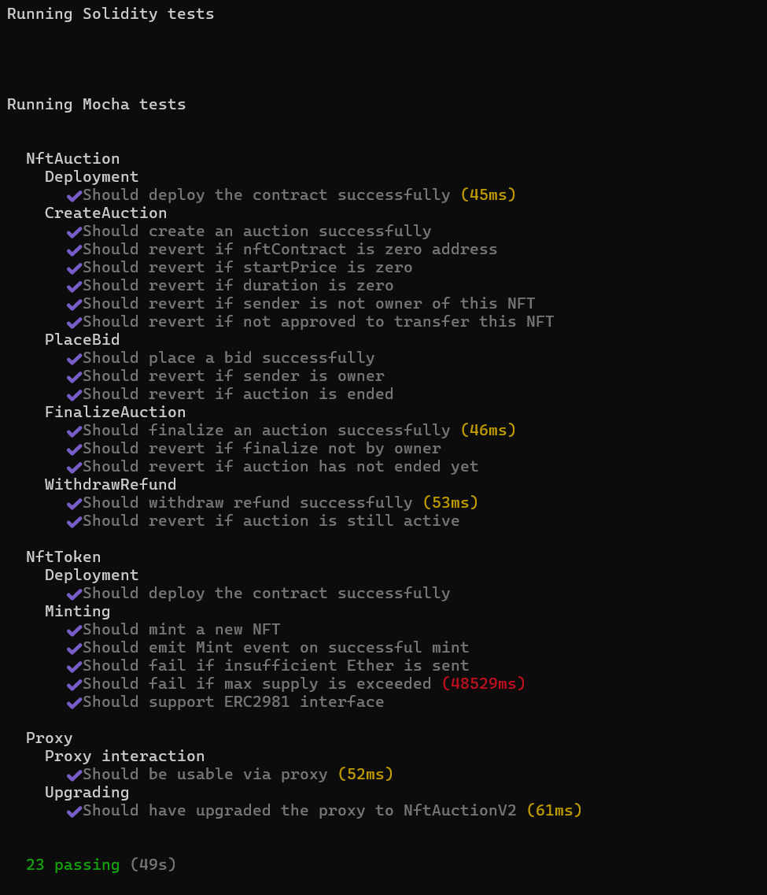
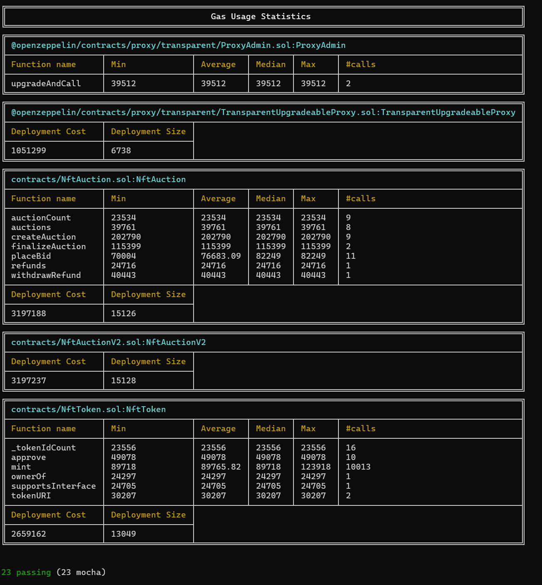
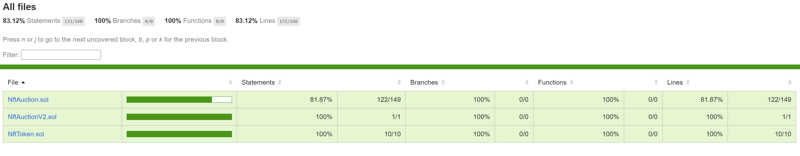

# NFT Auction Project (Hardhat 3 Beta Project (`mocha` and `ethers`))

This project showcases a Hardhat 3 Beta project using `mocha` for tests and the `ethers` library for Ethereum interactions.

To learn more about the Hardhat 3 Beta, please visit the [Getting Started guide](https://hardhat.org/docs/getting-started#getting-started-with-hardhat-3). To share your feedback, join our [Hardhat 3 Beta](https://hardhat.org/hardhat3-beta-telegram-group) Telegram group or [open an issue](https://github.com/NomicFoundation/hardhat/issues/new) in our GitHub issue tracker.

## Project Overview

This project includes:

- a Hardhat configuration file.
- contracts - Solidity contract files.
- scripts - Typescript script files.
- TypeScript integration tests using `mocha` and ethers.js.
- Examples demonstrating how to connect to different types of networks, including locally simulating OP mainnet.

## Usage

### Compile Solidity Files

To compile all the solidity files in the project, execute the following command:

```shell
npx hardhat build
```

### Running Tests

To run all the tests in the project, execute the following command:

```shell
npx hardhat test
```

You can also selectively run the Solidity or `mocha` tests:

```shell
npx hardhat test solidity
npx hardhat test mocha
```

### Make a deployment

This project use ignition module to deploy the contract. You can deploy this module to a locally simulated chain or to Sepolia.

To run the deployment to a locally chain:

```shell
npx hardhat ignition deploy ignition/modules/NftToken.ts
```

To run the deployment to Sepolia, you need an account with funds to send the transaction. The provided Hardhat configuration includes a Configuration Variable called `SEPOLIA_PRIVATE_KEY`, which you can use to set the private key of the account you want to use.

You can set the `SEPOLIA_PRIVATE_KEY` variable using the `hardhat-keystore` plugin or by setting it as an environment variable.

To set the `SEPOLIA_PRIVATE_KEY` config variable using `hardhat-keystore`:

```shell
npx hardhat keystore set SEPOLIA_PRIVATE_KEY
```

After setting the variable, you can run the deployment with the Sepolia network:

```shell
npx hardhat ignition deploy --network sepolia ignition/modules/NftToken.ts
npx hardhat ignition deploy --network sepolia ignition/modules/ProxyModule.ts
```

If need to upgrade contract, you can run the following command:

```shell
npx hardhat ignition deploy --network sepolia ignition/modules/UpgradeModule.ts
```

### Sepolia contract address

NftToken address : 0x4AF12344c14F901EC3486c40Da93Fd537bd8EEEd

NftAuctionV1 address : 0x1c4a7FF3636998739A3745aa552EFe8642D4f15c

NftAuctionV2 address : 0x1EeB5c9D7cc46b90e5F232e84DC49593860638e5

Proxy contract address : 0xf1717512f66a36C4d841D510D6fB17506fAb0605

### Test result



### Gas status



### Test converage


